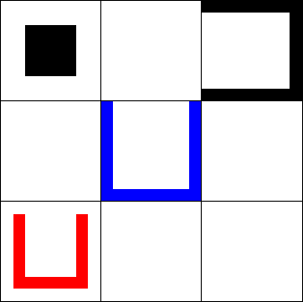

# Állapottér reprezentáció

Mielőtt belevágnánk a kódolásba, érdemes egy picit terveznünk, vagy ahogy a mondás tartja:

> Weeks of coding can save you hours of planning.

Random reddit thread hozzá: https://www.reddit.com/r/PHP/comments/12o9dz/weeks_of_coding_can_save_you_hours_of_planning/

## Miért szükséges az állapottér reprezentáció?

Na, de akkor mit is kellene megterveznünk? A Sliding Puzzle egy egyszemélyes játék, melyben a játékos célja, hogy a blokk megfelelő mozgatásával a piros vödröt a kék vödörbe mozgassa. A játék lépésekből áll, egy lépés a blokk egy négyzetrácsnyi elmozdítását jelenti.

Az alkalmazásunknak minden pillanatban tudnia kell, hogy
- mely lépések szabályosak,
- teljesült-e a cél, azaz nyert-e a játékos.

Szeretnénk továbbá megoldáskeresőt is készíteni, mely tetszőleges kezdőállapotból kiindulva meg tudja keresni a nyertes álláshoz vezető lépéseket.

A fenti követelmények mindegyikét kielégítő eszközkészlet például az állapottér reprezentáció. Ennek segítségével egy tömör, programozási nyelvekre jól lefordítható leírását tudjuk adni a játékunknak.

A következőkben felvázoljuk a Sliding Puzzle állapottér reprezentációs leírását. A definíciónk korántsem lesz teljesen pontos, épp csak annyira megyünk bele formulákba és logikába, amennyire szükséges. Javasolt tehát az ismereteink felfrissítése a továbbolvasás előtt:
- [Dr. Várterész Magdolna: Mesterséges intelligencia 1 előadások](https://arato.inf.unideb.hu/varteresz.magda/mi1folia/foliafo.pdf)

## Mi kell egy állapottér reprezentációhoz?

Mindenekelőtt egy probléma, ami nekünk már adott: a Sliding Puzzle játék.

Ezek után már egyenes az út:
- Szükségünk van a játék releváns jellemzőire (mint például a bábuk állapota), melyekből a játék állapotait tudjuk majd származtatni.
- Kell egy kezdőállapot (ahonnan a játék indul), valamint a célállapotok leírása (ahol véget ér).
- Végül, le kell írnunk a lépéseket, melyek egyik állapotból a másikba visznek. Precízen kifejezve, ezek az operátorok és azoknak az alkalmazási előfeltételei.

## A Sliding Puzzle állapotai

A játék világában a következő jellemzők lesznek számunkra érdekesek:
- a blokk pozíciója,
- a kék vödör pozíciója,
- a piros vödör pozíciója,
- a fekete vödör pozíciója.

Minden pozíció egy négyzetnek felel meg a táblán, ahol `(0, 0)` lesz a bal felső négyzet, míg `(2, 2)` a jobb alsó.

A fenti négy pozícióból tudjuk felírni a játék állapotait.

## A kezdőállapot és a célállapotok

A kezdőállapotunk az alábbi:



```
blokk: (0, 0)
kék: (1, 1)
piros: (2, 1)
fekete: (0, 2)
```

A célállapotokat az alábbi feltétellel írhatjuk le:
- A piros vödör a kék vödörben van.

Azaz:
```
kék-pozíció = piros-pozíció
```

## Operátorok és az operátoralkalmazási előfeltételek

Lépni, azaz az aktuális állapotot megváltoztatni operátorok alkalmazásával tudjuk. Az operátoraink az alábbiak lesznek:
- a blokk balra mozgatása,
- a blokk jobbra mozgatása,
- a blokk felfelé mozgatása,
- a blokk lefelé mozgatása.

Ha a blokkunk egy (vagy több) vödörben van, akkor a blokk mozgatása a tartalmazó vödrök mozgatását is jelentheti, ahogy a következő képen is szerepel:


Természetesen nem lehet akármikor akármelyik operátort alkalmazni, hanem [(ahogy a fociban is ismert)](https://hu.wikipedia.org/wiki/TrollFoci) vannak szabályok.

Ezek a szabályok az alábbiak:
- Semelyik bábu nem kerülhet a táblán kívülre.
- A bábut csak akkor mozgathatjuk olyan négyzetre, amelyen vödör található, ha a bábu a vödör nyitott oldalán haladna át.

Ezzel a rövid leírással már jók is leszünk, el is kezdhetünk programozni!
